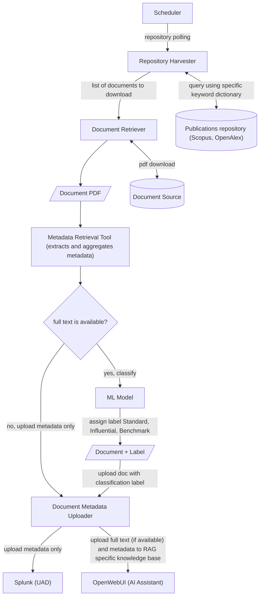

# DUA

The purpose of the DestinE Usage Assessment (DUA) framework services is to provide a system capable of tracing and measuring the impact of knowledge, generated by DestinE associated assets and DESP registered services, in worldwide publicly available academic documents and policy. In this frame, the next table recap the TIA and UAD service class.

|Acronym|Service Class|||
|---|---|---|---|
|TIA|DestinE Traceability and Impact Analysis Services|Multi-level Multilingual Traceability Service|Policy and Academic Documents Repositories|
|||Metadata Retrieval, Usage Assessment Metrics, Benchmark Dataset|Metadata Retrieval Tool|
|||Use case|Earth Explorer Missions use case|
|UAD|DestinE Usage Assessment Dashboard Services|DestinE Documents Repository|
|||DestinE Documents Statistics||
|||AI Assistant for Earth Observation||

## Overview

The DestinE Usage Assessment (DUA) framework follows a structured and automated information flow to retrieve, analyse, classify, and store metadata from public document repositories. This process ensures that relevant academic and policy documents related to the DestinE initiative and other Earth observation programs are systematically identified, processed, and made available for analytical exploration and AI-assisted queries.

The process is initiated by a scheduler, which coordinates repository polling based on predefined configurations (configuration manager). The scheduler sends repository-specific information to the repository harvester, using parameters such as polling intervals and repository lists managed by the configuration manager. The repositories include sources such as OpenAlex, Scopus and JRC.

Once a repository is triggered for processing, one repository harvester instance queries the public document repositories and retrieves metadata for newly published documents. The retrieval is guided by predefined keyword dictionaries (configured in the configuration manager component) that ensure relevance to the DestinE initiative or other configured research topics. The metadata, along with document download references, is then dispatched to the document retriever.

A document retriever instance proceeds to fetch the full-text document from the source repository. The metadata retrieval tool is then activated to extract the full text of the document, refine the metadata, and enrich it with additional information. This step ensures that structured data attributes such as title, authors, publication source, document type, and abstract are correctly formatted and aggregated. Depending on whether the full-text content is available, the metadata is either forwarded to the ML Model for impact classification or directly sent to the uploader for storage.

For documents containing full text, a machine learning classification model is applied, assigning an impact classification label (either **Standard**, **Influential**, or **Benchmark**). The three labels identify the different weight the initiative has on the article, in order of relevance they are: Standard (low or no impact), Influential (medium impact), Benchmark (very high impact).

At this stage, the metadata uploader transmits the structured metadata to two primary destinations:

- Splunk Enterprise (inside the UAD Service), where it is indexed and made accessible through the UAD Service’s interactive dashboards for detailed analytics.
- OpenWebUI-powered knowledge base: The metadata, along with the full text of the document (if available), is stored in a retrieval-augmented generation (RAG) system, enabling advanced AI-driven searches.

Within Splunk Enterprise, the UAD Service provides three specialized dashboards for end-users:
- The DestinE Documents Repository Dashboard allows users to explore retrieved documents using filters such as initiative, mission, document type, repository, and classification label.

- The DestinE Documents Statistics Dashboard presents aggregated insights, including document distribution by country, top authors, and leading journals.

- The AI Assistant for Earth Observation Dashboard offers an AI-powered assistant, allowing users to ask natural language queries about specific missions and receive contextually relevant responses with citations.

The integration with OpenWebUI, Ollama, and Mistral-7B provides an intelligent AI-powered interface for users seeking in-depth insights. By leveraging the Mistral-7B model, which is a state-of-the-art European AI initiative, the system ensures context-aware, citation-backed responses based on the enriched knowledge base. Users can interact with the assistant to retrieve relevant publications, examine cited sources, and navigate to the DestinE Documents Repository Dashboard for further exploration.

Through this automated workflow, the DUA framework ensures seamless document retrieval, impact classification, structured metadata storage, and interactive analytical access, empowering researchers, policymakers, and decision-makers to evaluate DestinE’s influence on scientific and policy discourse.

## Demo

### DestinE Document Repository

The DestinE Documents Repository dashboard displays metadata of retrieved and processed documents. It is possible to apply several filter to the result-set such as "Use Case" (Earth Explorers, Copernicus, DestinE), "Mission" (e.g., Aeolus, GOCE, Sentinel-1, etc.), "Document Type" (academic, policy, ESA tech), "Repository" (source document repository) and "Classification" (standard, influential, benchmark)
It shows also some query result statistics in the form of pie charts for classification, missions, repositories, journals, and the list of top 5 authors.

### DestinE Documents Statistics

The dashboard aggregates document statistics for analytical insights, giving the user details about documents distributions from a geographical point of view. It is possible to apply some filters to delimit the statistics results, such as "Use Case", "Mission" and "Document Type". It shows  the count of total documents, affiliation countries, authors, and journals with document distribution by country shown on a map, the top 10 authors list and a pie chart for top 10 journals.

### AI Assistant for Earth Observation

This web interface provides an AI Assistant interaction for querying the knowledge base about the documents collected for all initiatives' missions. The user can select the interest mission using a dedicated dropdown, then he can interact with a chat interface for mission-related inquiries. For each Assistant's response, are provided citation details (if available) including snippet, document relevance, and link to DestinE Documents Repository for further analysis.

### Live Demo

To try the DestinE Usage Assessment live demo, click on the following link and use the credentials: 

- username: *guest*
- password: *DuaGuest!!*

# Services

- [TIA](tia/README.md)
- [UAD](uad/README.md)

