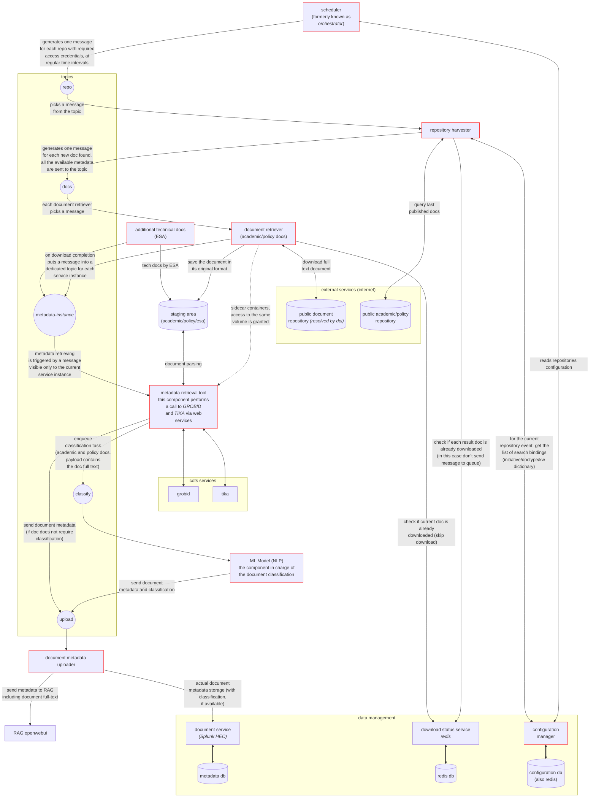
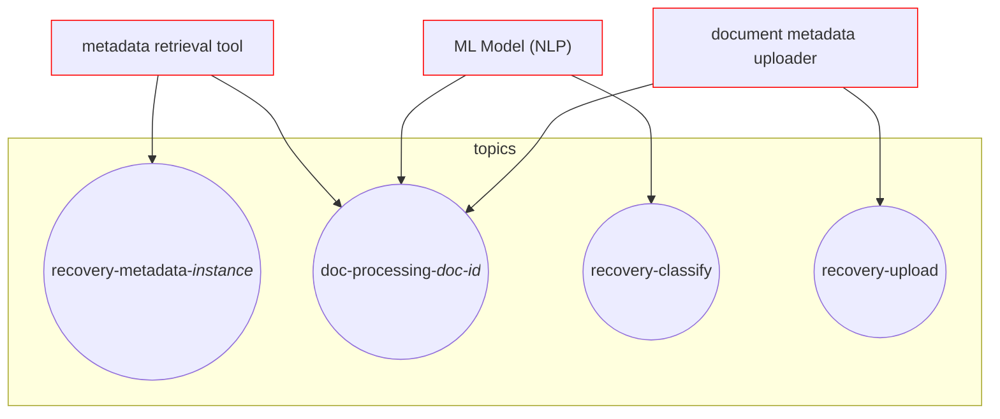

# TIA Service

In the *DUA* project, the TIA Service is responsible of harvesting new *academic* and *policy* documents from the configured journal repositories, download their metadata and full-text PDFs (where available), evaluate the *Initiative* impact on these documents through an NLP-ML model, and archive those information on a data storage shared between the other *DUA* services (e.g. UAD).

The subject *Initiatives* can be easily and dynamically configured (see the [configuration manager documentation](dua-tia-configuration-manager/README.md)). More than one *Initiatives* can exists at a time, several document repositories can be configured for each of them and different keyword dictionaries can be applied during the harvesting process.

This *Git* module describes the overall TIA Service behaviour giving the system overview and the logic behind the integration between its sub-components.

## Components interactions diagram

Follows the components interaction diagram which describe the flow of information between the various components of the *TIA* service.

Within the diagram, the *core* components are highlighted in red.

The following list reports each core components' git repository:

- configuration manager: **dua-tia-configuration-manager**
- scheduler: **dua-tia-scheduler**
- repository harvester: **dua-tia-repository-harvester**
- document retriever: **dua-tia-document-retriever**
- metadata retrieval tool: **dua-tia-metadata-retrieval-tool**
- ML Model (NLP): **dua-tia-ml-model**
- document metadata uploader: **dua-tia-metadata-uploader**

## Diagnostics and error handling

In case of an information processing error, the originating event of a certain queue is stored "as-is" in a corresponding queue named "recovery-*queue name*". In this way it is always possible to reprocess every event simply by putting it back to the originating queue.

During the metadata extraction, the classification and the metadata uploading, a special "doc-processing-*doc-id*" hash-set tracks the status of each individual step of the document processing.

## Software Design

The software system architecture involves multiple components that work together to retrieve, manage, and classify documents from public repositories. Here is a breakdown of the components and their roles:

### **1. Scheduler**
   - **Role**: generates messages for each repository that needs to be accessed. It sends these messages to a queue management system at regular intervals.
   - **Inputs**: configuration settings from the *configuration manager* component, specifically the repositories to be contacted and their polling periods.
   - **Output**: messages sent to the queue management system's topic related to repositories.

### **2. Queue management system**
   - **Role**: handles messages in different topics. This system distributes tasks among various components, and specifically it is composed by the **redis** No-Sql DBMS.
   - **Topics**:
     - **repo**: messages generated by the scheduler for each repository.
     - **docs**: messages picked up by document retrievers to process document retrieval tasks.
     - **metadata-{instance}**: dedicated for each service instance, triggered by the completion of document downloads.
     - **classify**: tasks are enqueued here to classify documents using an NLP model.
     - **upload**: documents that shall be uploaded to the target components are added to this queue.

### **3. Repository harvester**
   - **Role**: queries public document repositories and retrieves metadata about available documents.
   - **Inputs**:
     - **Public Academic/Policy Repository**: queries the last published documents.
     - **Public Document Repository**: its the repository which contain the real PDF document of the publication; it's the target of the URL resolved by the document DOI.
   - **Output**: generates messages for each new document found, sending all available metadata to the *repo* topic in the queue management system.

### **4. Document retriever**
   - **Role**: picks up messages from the *docs* topic and is responsible for downloading the full text of documents.
   - **Processes**:
     - downloads and saves documents in their original format in a staging area.
     - upon completion, it puts a message into the *metadata-instance* topic for the specific service instance.

### **5. Staging area**
   - **Role**: temporary storage for documents in their original format after they have been retrieved.

### **6. Metadata retrieval tool**
   - **Role**: retrieves additional metadata by making calls to external services like GROBID/Tika (and others) via web services.
   - **Process**:
     - triggers metadata retrieval tasks upon receiving a message.
     - aggregage the various metadata obtained from the document.
     - propagate messages to the *ml model* or *metadata uploader*.

### **7. ML model (NLP)**
   - **Role**: performs document classification using Natural Language Processing (NLP).
   - **Process**:
     - it is triggered by tasks in the *classify* topic.
     - updates the document classification metadata.
     - propagate the document metadata with classification to the *upload* queue.

### **8. Configuration manager**
   - **Role**: stores configuration data about *Initiatives*, *repositories*, *document types*, *keyword dictionaries* used by the various TIA components and it's leveraged by a set of REST APIs.

### **9. Databases**
   - **Redis Database (redis db)**: stores the configurations handled by the *configuration manager*, the processing queues and the status of document downloads.
   - **Splunk Metadata Database (metadata db)**: stores metadata retrieved from documents, including classification results.

### **Flow Summary**:

1. the *scheduler* triggers the process by sending repository information to the *repo* queue, using the repositories configuration and polling times from the *configuration manager*.
2. the *repository harvester* queries public repositories and generates metadata for new documents, using the initiatives and keyword dictionaries configured in the *configuration manager*, and send the documents data to the *docs* queue.
3. the *document retriever* downloads these documents, storing them in the staging area, and informs the *metadata retrieval tool* which performs full text and metadata extraction, additional metadata enrichment and aggregation; proper messages are dispatched to the *upload* or *classify* queues.
4. metadata is then classified using the *ml model*. 
5. the *metadata uploader* uploads the document metadata to the *UAD Service* and *OpenWebUI* knowledge.

# Modules

- [Configuration Manager](dua-tia-configuration-manager/README.md)
- [Scheduler](dua-tia-scheduler/README.md)
- [Repository Harvester](dua-tia-repository-harvester/README.md)
- [Document Retriever](dua-tia-document-retriever/README.md)
- [Metadata Retrieval Tool](dua-tia-metadata-retrieval-tool/README.md)
- [ML Model](dua-tia-ml-model/README.md)
- [Metadata Uploader](dua-tia-metadata-uploader/README.md)
